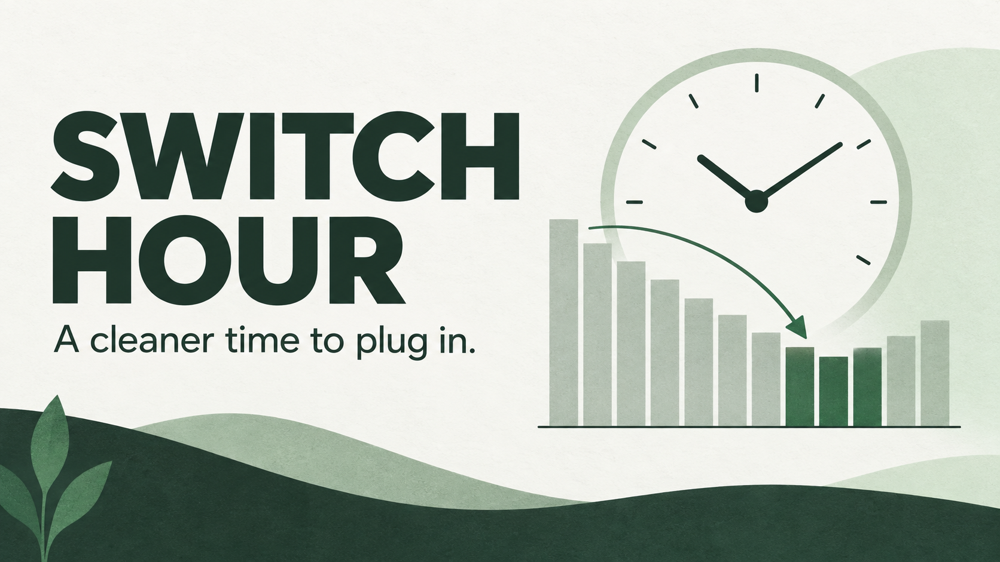
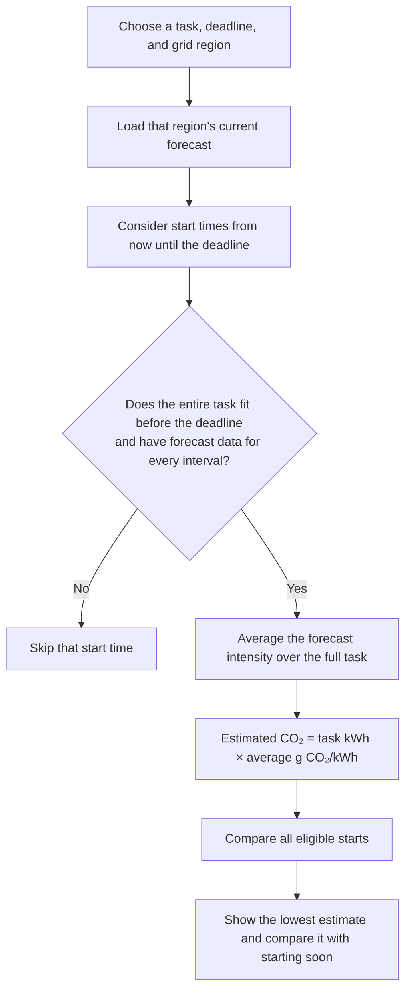

# Switch Hour



Switch Hour recommends when to start a flexible electrical task so it finishes before your deadline with a lower forecast emissions estimate. [Try the live app](https://obstudio.org/tools/switch-hour/).

## Use it

1. Choose a task, a completion deadline, and an electricity grid region.
2. The app checks the current forecast and compares every complete start window from the time you opened it onward.
3. Read the suggested start in the selected region's local time, or save it to your calendar.

The task examples have editable run time and energy estimates. The app never controls a device. It refreshes forecasts every five minutes while the page is visible, and recalculates when time advances. If a current forecast cannot be loaded, it shows an error instead of giving advice from old data.

## Data and meaning

| Region | Forecast | Resolution | What the comparison estimates |
| --- | --- | --- | --- |
| Four California grid regions | [CEC MIDAS / WattTime SGIP](https://github.com/california-energy-commission/MIDAS) marginal emissions | 5 minutes | Difference in forecast marginal emissions for the task |
| Great Britain and London | [NESO Carbon Intensity API](https://carbon-intensity.github.io/api-definitions/) under CC BY 4.0 | 30 minutes | Difference in estimated task emissions using average grid intensity |

Both data sources give g CO₂/kWh and UTC timestamps. The app formats California results in Pacific time and Great Britain results in London time, accounting for daylight saving time. The source and limitations appear with each result. The two metrics have different meanings; the app does not compare California against Great Britain.

The task uses the same total kWh and assumes even power consumption in both windows. Forecasts can change, and actual outcomes may differ. Only a complete forecast for the full run is eligible. If starting at the first available interval is best, the app reports zero difference.

## How the start time is calculated



The same flow is available as a [shareable diagram](how-it-works.png) for the project submission.

For example, a 2 kWh task during a window averaging 200 g CO₂/kWh has an estimate of **400 g CO₂**. If another complete window averages 150 g CO₂/kWh, its estimate is **300 g CO₂**, or **100 g (25%) lower**. These are forecast comparisons, not measured emissions. The scheduler compares each complete run, not a single low bar on the chart. Its code is in [`scheduler.js`](scheduler.js).

## Run locally

You need Node.js and npm. Clone this repository, then run:

```sh
cd switch-hour
npm start
```

Open **http://localhost:3000** in your browser. `npm start` launches a static file server; its first run may download the `serve` package through `npx`. If port 3000 is already in use, stop the other server first. The California forecast relay allows `localhost:3000` for local testing.

Alternatively, with Python installed, run `python -m http.server 3000` in this directory and open the same address. Opening `index.html` directly as a `file://` page is not recommended. A network connection is needed for live forecasts. The California relay is a deployed, read-only AWS Lambda URL; Great Britain data comes directly from NESO's public API. No API key is needed to try the app.

To run the scheduler checks, use:

```sh
npm test
```

The algorithm is in `scheduler.js`. Tests cover complete windows, deadlines, gaps, ties, midnight, and the historical fixture in `sample.json`. That fixture is only used by tests and never shown as a current forecast.

## Project

Built for Lake Oswego Hacks 2026. The public app is also hosted on OB Studio; its deployment source and California relay infrastructure are in the private OB Studio project. This repository holds the standalone app and its tests.
